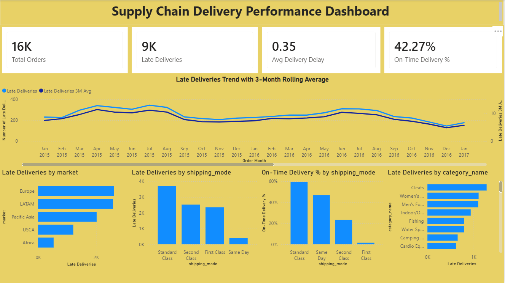

# powerbi-supply-chain-delivery-dashboard
Interactive Power BI dashboard providing insights into late deliveries, on-time performance, and shipping efficiency across markets and product categories to improve supply chain operations.
# Supply Chain Delivery Performance Dashboard (Power BI)

## Overview
This project presents an interactive **Power BI dashboard** that analyzes supply chain delivery performance.  
The goal is to identify **late delivery trends**, evaluate **shipping mode efficiency**, compare **regional performance**, and highlight **product categories** most impacted by delays—enabling data-driven logistics improvements.

---

## Business Questions & How the Dashboard Answers Them

### 1) How is delivery performance trending over time?
**Answer:**  
A monthly line chart with a **3-month rolling average** shows how late deliveries change over time while smoothing short-term volatility.

**Business Value:**  
- Identifies seasonal spikes and long-term improvement/decline  
- Supports proactive capacity and staffing planning  

---

### 2) Which markets contribute most to late deliveries?
**Answer:**  
A horizontal bar chart compares **Late Deliveries by Market**, ranked from highest to lowest.

**Business Value:**  
- Pinpoints underperforming regions  
- Enables targeted regional interventions and resource allocation  

---

### 3) Which shipping modes cause the most delays?
**Answer:**  
A bar chart shows **Late Deliveries by Shipping Mode**, highlighting modes with the highest delay volume.

**Business Value:**  
- Identifies inefficient logistics options  
- Informs carrier negotiations and shipping policy changes  

---

### 4) Which shipping modes perform best for on-time delivery?
**Answer:**  
A percentage-based bar chart displays **On-Time Delivery Rate by Shipping Mode**.

**Business Value:**  
- Encourages adoption of higher-performing shipping options  
- Improves customer satisfaction and SLA compliance  

---

### 5) Which product categories are most affected by delays?
**Answer:**  
A horizontal bar chart shows **Late Deliveries by Product Category**, ranked by impact.

**Business Value:**  
- Supports category-specific logistics and inventory strategies  
- Reduces customer complaints for high-risk products  

---

## Key KPIs
- Total Orders  
- Late Deliveries  
- Average Delivery Delay  
- On-Time Delivery Rate  

These KPIs provide an executive snapshot of overall supply chain health.

---

## How This Dashboard Improves Business Decisions
- **Operations:** Detects delay patterns and root causes  
- **Logistics:** Optimizes shipping mode selection  
- **Regional Management:** Focuses improvements where impact is highest  
- **Customer Experience:** Increases on-time delivery performance  
- **Leadership:** Enables data-driven planning and accountability  

---

## Tools & Techniques
- Power BI Desktop  
- DAX (KPIs, 3-Month Rolling Average)  
- Data modeling and interactive visual analytics  

---

## Repository Contents
- `Supply_Chain_Delivery_Performance.pbix` – Power BI report file  
    
---

## How to Use
1. Download the `.pbix` file  
2. Open it in **Power BI Desktop**  
3. Interact with filters and visuals to explore insights  

---

## Author
**Upendar Reddy**  
Data Analyst | Power BI | SQL | Python

---

